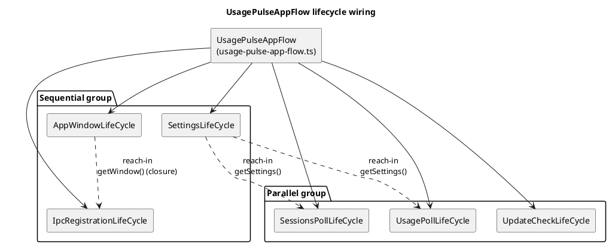

# LifeCycle Audit

Audit date: 2026-09-12
Branch: `refactor-cleanup-vibecode` (HEAD `fb46720`)
Scope: every class in `src/main/app-boot/` that participates in the app boot flow.
Method: six parallel read-only audits, one per LifeCycle class. Each audit listed the class public surface, grepped the whole repo for the class name and every public member, verified instantiation sites, and checked whether anything outside the app-boot flow reaches into the instance.

## Design intent

LifeCycle classes are meant to be closed:

- They are invoked only by the app flow (`UsagePulseAppFlow` extends `AppFlow` from `@beecode/msh-app-boot`), sequentially or in parallel, via the inherited `create()` / `destroy()` hooks.
- Nothing outside the app-boot flow may call into a lifecycle instance.
- Lifecycles may set up global things (singletons, loops, connections) that the rest of the app afterwards accesses through those globals, never through the lifecycle instance.

## Boot flow under audit

`UsagePulseAppFlow` (`src/main/app-boot/usage-pulse-app-flow.ts`) wires six lifecycles:

- Sequential group (runs in order): `SettingsLifeCycle`, `AppWindowLifeCycle`, `IpcRegistrationLifeCycle`
- Parallel group (runs after the sequential group): `SessionsPollLifeCycle`, `UpdateCheckLifeCycle`, `UsagePollLifeCycle`

The flow is constructed and created once at `src/main/index.ts:129-139`. Nothing in the repo calls `destroy()` on the flow.

Solid arrows: flow constructs and drives the lifecycle. Dashed arrows: lifecycle-to-lifecycle reach-ins beyond the framework hooks (the finding of this audit).

## Verdicts

| Class | Own public surface | Verdict |
|---|---|---|
| `AppWindowLifeCycle` | `getWindow()` | Closed as an instance; the window value escapes app-boot via a closure (see below) |
| `IpcRegistrationLifeCycle` | none | Closed; model of the intended pattern |
| `SettingsLifeCycle` | `getSettings()` | Reach-in target of two sibling lifecycles |
| `SessionsPollLifeCycle` | none | Closed |
| `UsagePollLifeCycle` | none | Closed |
| `UpdateCheckLifeCycle` | none | Closed |

No lifecycle instance is instantiated or referenced outside `usage-pulse-app-flow.ts` (instantiated at lines 31, 35, 41, 54, 55, 56). The renderer, preload, tests, and config contain zero references to any lifecycle class. Every inherited public member (`name`, `create()`, `destroy()`) is invoked only by the `@beecode/msh-app-boot` `AppFlow` machinery. No casting or other trick reaches into the protected fields.

## The `getWindow()` chain

`getWindow(): BrowserWindow` is defined at `src/main/app-boot/app-window-life-cycle.ts:15` and has exactly one direct caller:

1. `src/main/app-boot/ipc-registration-life-cycle.ts:51`: `_createFn` wraps it as `getWindow: () => this._appWindowLifeCycle.getWindow()` and passes the closure into `ipcController.register`.
2. That closure executes at four sites in `src/main/controller/ipc-controller.ts` (lines 196, 208, 220, 232), all inside push-listeners:
   - `pollService.onUpdate` sends `USAGE_UPDATE`
   - `sessionsPollService.onUpdate` sends `SESSIONS_UPDATE`
   - `settingsUseCase.onSave` sends `SETTINGS_UPDATE`
   - `updateService.onUpdate` sends `UPDATE_STATUS`

   Each listener guards with `browserWindow.isDestroyed()` before calling `browserWindow.webContents.send(...)`.

The controller layer never sees the lifecycle instance, only the deferred `() => BrowserWindow` closure. The closure indirection is needed because the window is created asynchronously by its own lifecycle, after IPC registration runs.

## Finding: lifecycle-to-lifecycle reach-ins

Three constructor injections pass a whole lifecycle instance to a sibling, which then calls a non-framework public method on it. All three stay inside `src/main/app-boot/`, so no external boundary is crossed, but they exceed the framework hooks and make lifecycles mutually aware:

1. `IpcRegistrationLifeCycle` receives `appWindowLifeCycle` (`usage-pulse-app-flow.ts:42`) solely to call `getWindow()` once and re-expose it as a closure.
2. `SessionsPollLifeCycle` receives `settingsLifeCycle` (`usage-pulse-app-flow.ts:54`) and calls `getSettings()` in `_createFn` (`sessions-poll-life-cycle.ts:17`).
3. `UsagePollLifeCycle` receives `settingsLifeCycle` (`usage-pulse-app-flow.ts:56`) and calls `getSettings()` in `_createFn` (`usage-poll-life-cycle.ts:17`).

Consequence: `AppWindowLifeCycle` doubles as the app's window source-of-truth (no global accessor exists; a fresh `AppWindow()` is created per `_createFn` call), and the window reference leaks into the controller layer through the closure.

### Fix shapes, if fully closed is wanted

- Window: introduce a module-level window store in `src/main/lib/` (for example `window-store`). `AppWindowLifeCycle._createFn` writes the created window to it; `ipcController` reads from it. Delete `getWindow()` and the `appWindowLifeCycle` constructor injection.
- Settings: have the flow pass the loaded `AppSettings` value (or a plain settings provider object) into the two poll lifecycles instead of the `SettingsLifeCycle` instance. Delete the `settingsLifeCycle` constructor injections and `getSettings()`.

## Cross-cutting observations

Not closedness violations, but consistent across the audit and worth deciding on deliberately:

- **All `_destroyFn` implementations are no-ops** (`app-window-life-cycle.ts:29`, `ipc-registration-life-cycle.ts:66`, `sessions-poll-life-cycle.ts:20`, `settings-life-cycle.ts:36`, `update-check-life-cycle.ts`, `usage-poll-life-cycle.ts:20`). Since `destroy()` is never called anywhere in `src/`, teardown relies on window-visibility events (`setWindowVisibility`) or process exit. A hypothetical second `create()` in one session would hit Electron's duplicate-IPC-handler error in `IpcRegistrationLifeCycle` and accumulate poll-service listeners.
- **Poll timers survive lifecycle destroy.** `UsagePollService.stop()` is reachable only via window-hide and `restart()`; `SessionsPollService` likewise tears down only through visibility events. If the flow were ever destroyed without app exit, poll timers would keep firing.
- **`getSettings()` returns the boot-time snapshot only.** The sole assignment to `_settings` is inside `_createFn` (`settings-life-cycle.ts:29`); runtime saves through `settingsUseCase.saveSettings` never refresh it. Boot-started poll services keep stale settings unless they re-read elsewhere.
- **Implicit ordering contract.** `getSettings()` throws if settings were not loaded (`settings-life-cycle.ts:20`). Its safety depends on `SettingsLifeCycle` being the first sequential entry at `usage-pulse-app-flow.ts:53`, before the parallel group. Reordering the flow list would surface as the "settings are not initialized" throw.
- **`UpdateCheckLifeCycle` swallows all errors.** `_createFn` fire-and-forgets `checkForUpdate().catch(() => undefined)`, so a failed update check is invisible to logs and the flow's `await flow.create()` returns before the check finishes.
- **No tests cover any lifecycle class.** No `*.test.ts` or contract file references any of the six classes.
