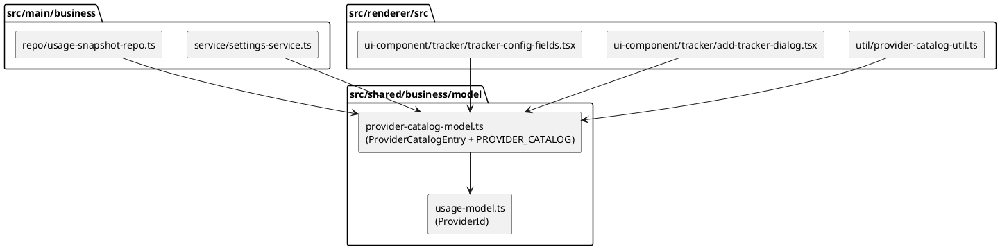

# Provider Catalog: Where the Data Belongs

Question: `src/shared/provider-catalog.ts` contains a type (`ProviderCatalogEntry`) plus a
hardcoded data array (`PROVIDER_CATALOG`). Where should this live in the clean architecture
layers? Instinct says DAL, but the data is never extracted at runtime and never searched.

## Verdict

**Not DAL. It is static domain reference data, and it belongs in the shared business model
layer: `src/shared/business/model/`.**

The current file is only misplaced by one level: it sits at the `src/shared/` root instead of
inside `src/shared/business/model/`, where every other shared domain shape lives.

> **Superseded 2026-09-11 (constants cleanup):** the app-wide constants pass moved the data
> array into the shared constant object as `constant.providerCatalog`
> (`src/shared/util/constant.ts`), keeping only the `ProviderCatalogEntry` type in
> `provider-catalog-model.ts`. Every UPPER_CASE constant was consolidated into the
> `constant`/`config` objects with camelCase keys grouped by usage, per the cleanup
> instruction; the DAL-rejection analysis below still holds.

## What this data actually is

Classification by properties:

| Property | Value | Consequence |
|---|---|---|
| Mutability | immutable at runtime | no write path, no persistence needed |
| Loading | compiled into the bundle | no I/O, no async, no storage medium |
| Domain awareness | keyed by `ProviderId`, describes providers | business layer, not util |
| Consumers | main (service, repo) + renderer (util, UI) | must stay in `src/shared/` |
| Lifecycle | changes only via a code change + release | not config, not remote data |

In domain terms this is a catalog of the supported provider kinds: `ProviderId` plus metadata.
It is the same species of thing as an enum with attributes, which is model-layer knowledge.

Terminology note: `ProviderCatalogEntry` is a **model**, not an entity. An entity is a class
mapped to a storage medium (TypeORM row, JSON document). There is no storage medium here, so
there is nothing for an entity (or a DAL) to map to.

## Why the DAL instinct is wrong

A DAL (or a repository wrapping it) answers one question: "which storage medium does this
code talk to?" For `PROVIDER_CATALOG` the answer is "none".

| DAL signal | Catalog reality |
|---|---|
| reads/writes a medium (DB, file, network) | data is a literal in the source file |
| async operations | pure in-memory array |
| entities mapped to storage | plain `I`-prefixed interface |
| queryable collection (find, filter, paginate) | iterated once to render dropdowns/defaults |
| lifecycle beyond process exit | none; rebuilt into every release |

A `ProviderCatalogRepo` would wrap a nonexistent data source: indirection with zero benefit,
plus a fake async signature for a synchronous literal. The deciding test is the storage
medium, not the "entity + data" shape. The shape resembles entity + seed rows, but seed rows
exist to be loaded from somewhere; this array never loads from anywhere.

## Why not `util`

`src/shared/util/constant.ts` is the precedent, and it holds a generic 24-hour time regex:
values with no domain knowledge. `PROVIDER_CATALOG` is keyed by `ProviderId` and describes
domain concepts (providers, their defaults). Per the layer rule (domain awareness is the
dividing line), that makes it business-layer data. Putting it in `util/` would make the util
layer import domain models, inverting the dependency direction.

> **Reversed by the same constants cleanup:** `src/shared/util/constant.ts` already carried
> domain data (`maxWindowScheduleTriggerPreset`) and now centralizes every shared constant
> (settings defaults and bounds, usage windows, planner values), so the "generic values only"
> premise no longer describes the file. If the constant object is ever split back into
> generic vs domain, the catalog is the first value that belongs on the domain side.

## Options considered

| # | Option | Verdict |
|---|---|---|
| 1 | DAL + entity + repository | **Reject.** No storage medium to access; pure indirection. |
| 2 | JSON in `resource/`, loaded at boot | **Reject.** Only pays off when data must change without a rebuild. Here every change ships with a release anyway, and a JSON load adds boot-time parsing and a runtime failure mode for zero gain. |
| 3 | Shared business model file (type + constant together) | **Recommended.** Matches existing precedent, zero new concepts. |
| 4 | Catalog service (`providerCatalogService`) wrapping the data | **Later, optional.** Justified only when callers need named lookups (see below). |

## Recommendation: option 3

Move the file into the shared model layer and rename it to match the model naming convention.
`usage-model.ts` already exports domain constants alongside its types (`FIVE_HOUR_WINDOW_MS`,
`SEVEN_DAY_WINDOW_MS`), so a model file exporting a data constant has direct precedent
in this codebase.

Target: `src/shared/business/model/provider-catalog-model.ts`

Implemented 2026-09-11. One deviation from the snippet below: `ProviderCatalogEntry` ships
as a `type` (per reviewer preference), keeping the `I` prefix like the `TrackerConfig` union
in `settings-model.ts`. Note that every other object shape in the shared models is an
`interface`; `type` was otherwise reserved for unions and listeners.

```typescript
import type { ProviderId } from '#src/shared/business/model/usage-model'

export type ProviderCatalogEntry = {
  defaultRefreshIntervalMs: number
  description: string
  id: ProviderId
  name: string
}

export const PROVIDER_CATALOG: ProviderCatalogEntry[] = [
  {
    defaultRefreshIntervalMs: 900_000,
    description: 'Usage limits from your Claude coding plan',
    id: 'claude',
    name: 'Claude',
  },
  {
    defaultRefreshIntervalMs: 900_000,
    description: 'Usage limits from your GLM coding plan',
    id: 'zai',
    name: 'z.ai',
  },
  {
    defaultRefreshIntervalMs: 3_600_000,
    description: 'Dev-only test tracker that shows a native popup when its schedule fires',
    id: 'dummy',
    name: 'Dummy',
  },
]
```

The content does not change; only the file's home and name do.



### Migration steps

1. Move `src/shared/provider-catalog.ts` to `src/shared/business/model/provider-catalog-model.ts`.
2. Update five import sites (the entire blast radius, verified by search):
   - `src/main/business/service/settings-service.ts:38`
   - `src/main/business/repo/usage-snapshot-repo.ts:7`
   - `src/renderer/src/util/provider-catalog-util.ts:3`
   - `src/renderer/src/ui-component/tracker/add-tracker-dialog.tsx:18`
   - `src/renderer/src/ui-component/tracker/tracker-config-fields.tsx:12`
3. Run `lint-fix` (import order and paths are lint-enforced).
4. Update `resource/doc/architecture.md`, which still lists `provider-catalog.ts` at the
   `src/shared/` root (that doc predates the ongoing refactor).

Codegraph reports no tests covering the catalog. A cheap guard worth adding during the move:
a small test asserting every `ProviderId` union member appears in `PROVIDER_CATALOG` exactly
once. That pins the union and the catalog to each other, which today only the type checker
partially enforces (a missing entry compiles fine until a dropdown silently drops a provider).

## Option 4, if it grows: catalog service

Keep the data private to the model file and expose a service when callers start needing
named lookups instead of raw iteration:

```typescript
export const providerCatalogService = {
  findEntry: (params: { id: ProviderId }): ProviderCatalogEntry | undefined => {
    return PROVIDER_CATALOG.find((entry) => {
      return entry.id === params.id
    })
  },
  listEntries: (): ProviderCatalogEntry[] => {
    return PROVIDER_CATALOG
  },
}
```

Trigger to adopt: a second caller hand-rolling a `find` over the array, or default values
(like `defaultRefreshIntervalMs`) being read from more than one place. Today all five
callers either iterate for display or pick defaults in one spot, so the constant alone is
honest and sufficient. Wrapping it now would be speculative indirection, the same smell as
the rejected DAL option, just one layer shallower.

## Optional adjacent cleanup

`providerCatalogUtil` (renderer) filters dev-only entries via a parallel hardcoded list
(`DEV_ONLY_PROVIDER_IDS = ['dummy']`). That duplicates knowledge the catalog could carry:
add `isDevOnly: boolean` to `ProviderCatalogEntry` (falsy for real providers) and filter on
`entry.isDevOnly`. One source of truth instead of two lists that must be kept in sync when
the next dev provider is added. Independent of the move above; do it whenever convenient.
