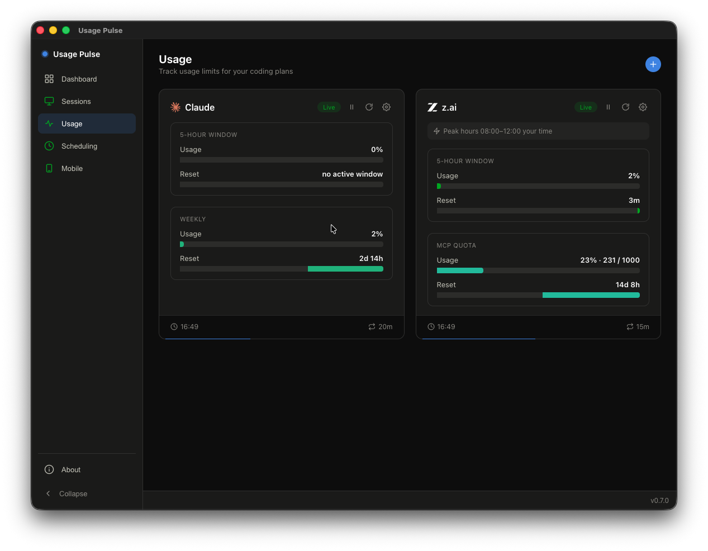
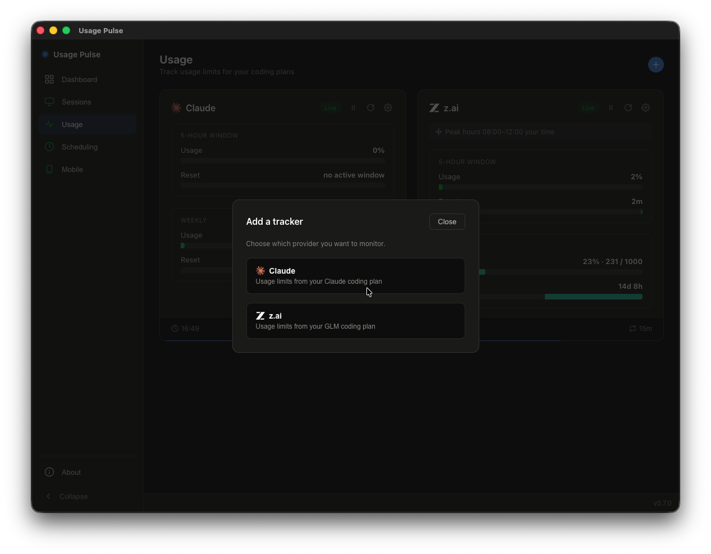
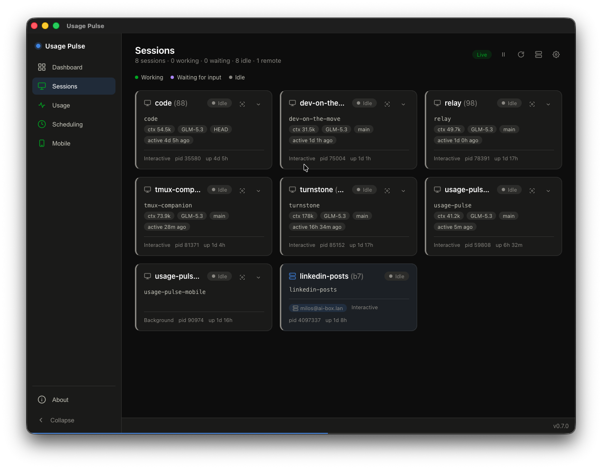
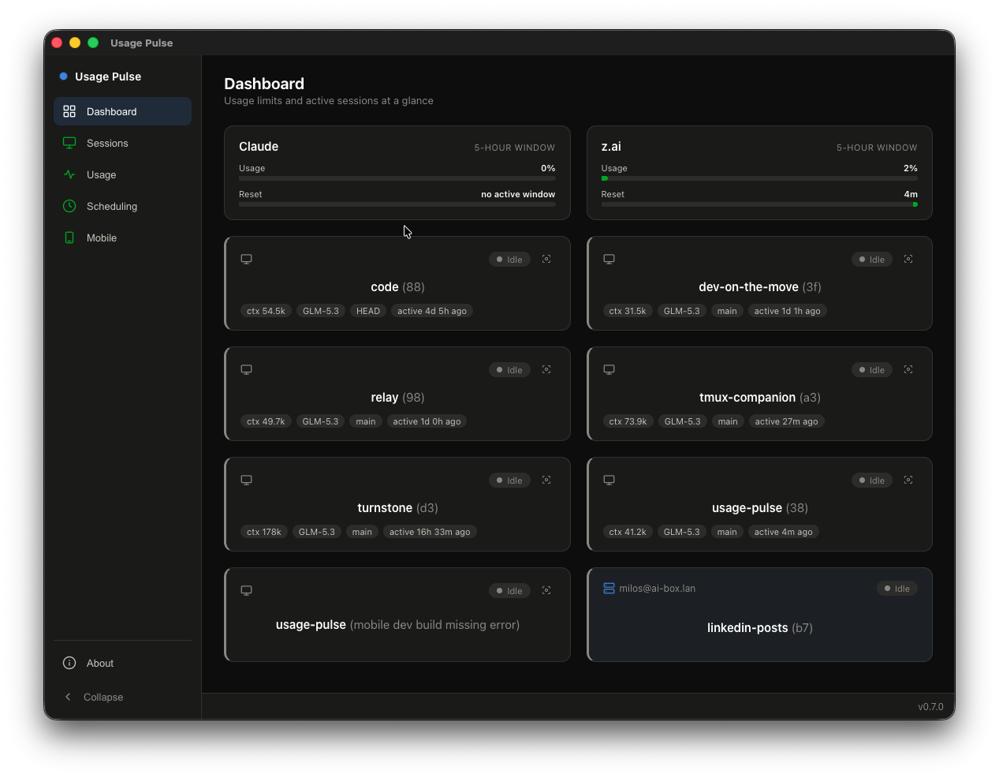
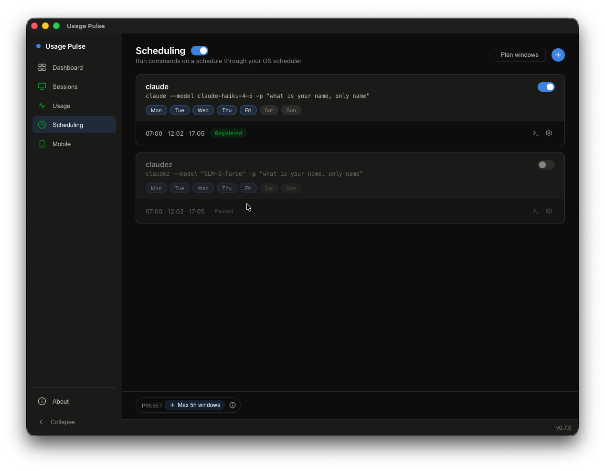
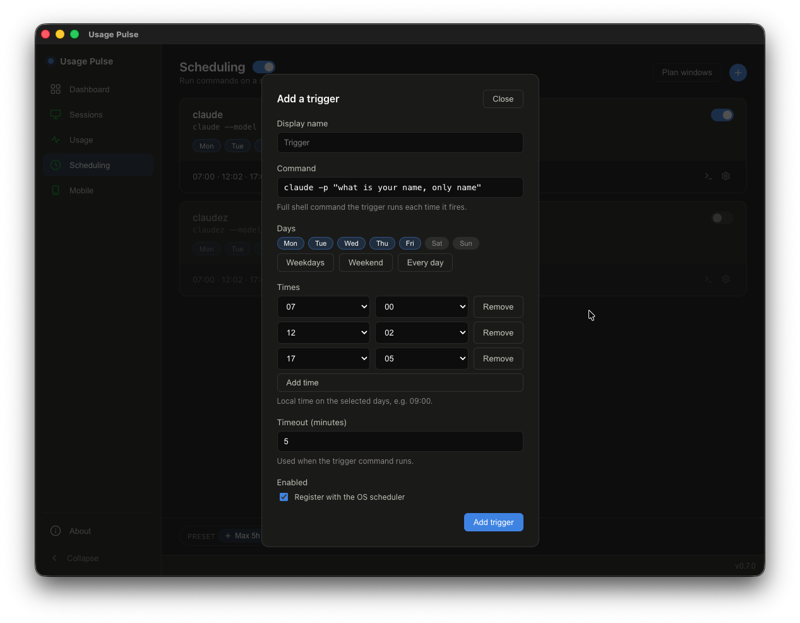
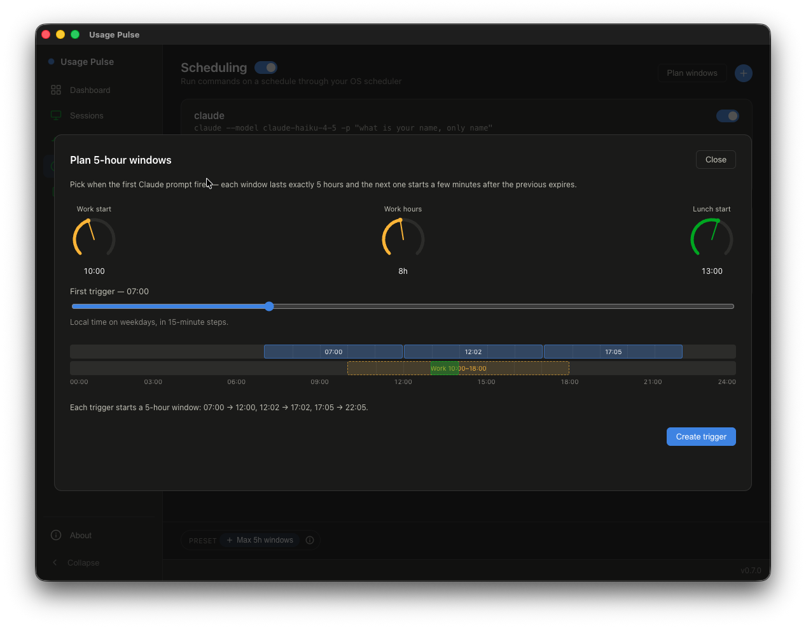
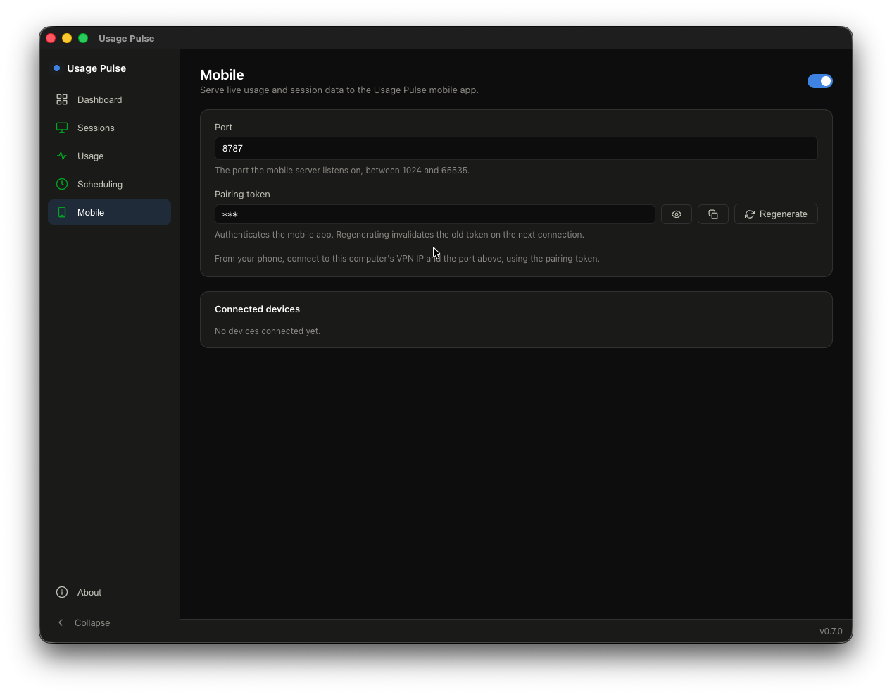

# Features

Detail behind the features listed in the README's Features section — settings, edge cases, and how things work under the hood.

## Usage limits (trackers)

Any number of provider trackers — Claude, z.ai, or several of each — each with its own token and settings behind the card's gear button (display name, token, remove). **+ Add** in the header opens a dialog that asks which provider to monitor; a new tracker card appears, ready for its token and display name from the card's gear menu.

Every card shows the 5-hour window (utilization % plus a bar counting down to the reset) and the long window: weekly for Claude, MCP quota with consumed counts (e.g. `26 / 1000`) for z.ai, along with a Live badge and a pause button. The footer tracks the last poll time and interval.

Tokens stay on your machine: they are stored only in `usage-pulse-settings.json` inside the app's userData folder and are sent exclusively to the provider their tracker belongs to. For how trackers are stored, the endpoints each provider polls, and how to get a token for each provider, see [trackers.md](trackers.md).

## Active sessions

Sessions are discovered locally and on remote SSH hosts. Each card shows the project folder, transcript stats (context tokens, model, branch), how recently it was active, plus pid and uptime. Clicking a card focuses that session's terminal window so you can jump straight to the one waiting for you (macOS, Linux X11). The screen's header sums everything up (`2 sessions · 2 working · 0 waiting · 0 idle · 1 remote`) with a status legend underneath.

## Overview dashboard

The landing screen is a combined at-a-glance view: one compact usage card per tracker across the top (5-hour window utilization and time until reset), then a row per running session with its status, project folder, context tokens, model, branch, and last activity. Click a row to focus that session's terminal window.

## Scheduling

A provider's 5-hour window opens when your first prompt lands, so a tiny scheduled prompt at 07:00, 12:02 and 17:05 deliberately opens fresh windows that together cover an 8-hour workday — instead of one window that starts whenever you happen to begin and runs out mid-afternoon.

Scheduled triggers registered from the AppImage re-invoke the AppImage file itself, so they keep working after reboots.

On the Scheduling screen a master toggle enables the whole feature; each task lists its command, the weekdays it runs on, and its trigger times, with a status showing whether it is registered with the scheduler. Each task can be run immediately or edited from its row, and the **+ Max 5h windows** preset and the **Plan windows** button both open the window planner (below).

**+** opens the new-trigger dialog: give the trigger a display name and the full shell command it fires, pick the weekdays and trigger times (with Weekdays / Weekend / Every day shortcuts), set a timeout in minutes, and choose whether it registers with the OS scheduler right away.

## Window planner

The **Plan 5-hour windows** dialog stacks 5-hour usage windows over your workday: set work start, work hours, and lunch start on the dials, then drag the first-trigger slider (15-minute steps). The timeline previews the resulting windows against your work and lunch bars, warns you if the windows miss the edges of the workday, and **Create trigger** writes the computed start times back as a new scheduled task.

## Menu status dots

Red = error on any screen, purple = a session waiting for an answer, orange = usage pace outpacing the window, stale data, or a provider in z.ai peak hours.

## Session sounds

A configurable sound, with volume, for when a session starts waiting and when one finishes.

## Mobile API

An opt-in server inside the app streams the same live usage and session data to the Usage Pulse companion app ([usage-pulse-mobile](https://github.com/beecode-rs/usage-pulse-mobile)) on your phone. You pick a port; the phone authenticates with a pairing token (masked, with reveal, copy, and regenerate — regenerating invalidates the old token on its next connection); the screen also lists the connected devices. From your phone, connect to this computer's VPN IP and the port. While the server is enabled, usage trackers keep polling in the background even when the app window is not visible.

## Update check

The footer links the latest release when a newer version is out.

## Disclaimer

Usage Pulse relies on an undocumented Claude usage endpoint, and its scheduler deliberately fires small prompts to open fresh 5-hour usage windows. Both are use-at-your-own-risk: providers may change or restrict this behavior at any time, and how you use the app is your responsibility under each provider's terms of service.
